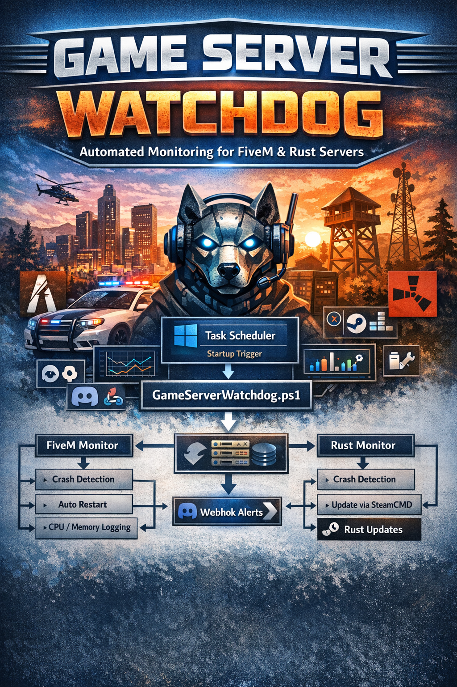

<p align="center">
  
</p>

# 🎮 Game Server Watchdog v2

### Automated Monitoring System for FiveM & Rust Servers

**Created by Majestic44**


---

# 📌 Overview

**Game Server Watchdog v2** is a Windows-based monitoring and automation system designed to keep dedicated game servers running reliably with minimal manual intervention.

The system continuously monitors server processes and automatically handles crashes, restarts, updates, and logging.

It was designed primarily for:

* **FiveM (GTA V Multiplayer)**
* **Rust Dedicated Servers**

However, the architecture allows it to be extended to support **any server process**.

---

# 🚀 Key Features

## Crash Detection

The watchdog continuously monitors running processes.

If a server process stops unexpectedly:

1. The event is logged
2. A Discord alert is sent
3. The server is automatically restarted

---

## Restart Protection (Anti-Crash Loop)

Servers that crash repeatedly can cause infinite restart loops.

The watchdog includes protection:

| Setting        | Default    |
| -------------- | ---------- |
| Max Restarts   | 5          |
| Restart Window | 15 minutes |
| Cooldown       | 15 minutes |

If a server exceeds the restart limit, it will pause restarts temporarily.

---

## Discord Webhook Alerts

The system sends automated alerts to a Discord channel.

Alerts include:

* Server started
* Server crashed
* Restart triggered
* Restart limit reached
* Rust update started
* Rust update completed
* Watchdog errors

Example alert:

```
🔴 Rust server crashed unexpectedly
Attempting automatic restart...
```

---

## Server Resource Monitoring

Performance metrics are logged for each server.

Metrics include:

* CPU usage
* Memory usage
* Private memory allocation
* Thread count
* Handle count

Example log entry:

```
[2026-03-09 14:11:30] FiveM PID=1234 CPU=8% WS=512MB Private=478MB Threads=71 Handles=1432
```

Metrics are stored in:

```
C:\GameServers\logs\metrics.log
```

This makes it possible to analyze long-term performance trends.

---

## Automatic Rust Updates

Rust servers are updated automatically through **SteamCMD**.

The watchdog runs the following command:

```
steamcmd +force_install_dir C:\GameServers\Rust +login anonymous +app_update 258550 validate +quit
```

Updates occur:

* At watchdog startup
* At configured intervals
* Only when the Rust server is offline

This prevents updates from interrupting active players.

---

# 🧠 System Architecture

```
            ┌──────────────────────┐
            │  Windows TaskScheduler│
            │  (Startup Trigger)    │
            └──────────┬───────────┘
                       │
                       ▼
               watchdog.bat
                       │
                       ▼
          GameServerWatchdog.ps1
                       │
        ┌──────────────┼──────────────┐
        ▼                             ▼
 FiveM Monitor                 Rust Monitor
        │                             │
        ▼                             ▼
 Process Check                 Process Check
        │                             │
        ▼                             ▼
 Restart if needed            Restart if needed
        │                             │
        ▼                             ▼
 Discord Alerts               SteamCMD Updates
        │                             │
        ▼                             ▼
 CPU / Memory Logging        CPU / Memory Logging
```

---

# 📂 Recommended Folder Structure

```
C:\GameServers\
│
├── watchdog.bat
├── GameServerWatchdog.ps1
├── config.json
│
├── logs\
│   ├── watchdog.log
│   └── metrics.log
│
├── FiveM\
│   ├── FXServer.exe
│   └── start-fivem.bat
│
├── Rust\
│   ├── RustDedicated.exe
│   └── start-rust.bat
│
└── SteamCMD\
    └── steamcmd.exe
```

---

# ⚙️ Installation

## Step 1 — Extract the Package

Extract files to:

```
C:\GameServers
```

---

## Step 2 — Install SteamCMD

Download SteamCMD:

https://developer.valvesoftware.com/wiki/SteamCMD

Place the executable here:

```
C:\GameServers\SteamCMD\steamcmd.exe
```

---

## Step 3 — Configure the System

Open:

```
config.json
```

Update:

```
DiscordWebhookUrl
FiveMDirectory
RustDirectory
SteamCMDPath
```

---

## Step 4 — Configure Discord Alerts

1. Open your Discord server
2. Go to the target channel
3. Click **Edit Channel**
4. Select **Integrations**
5. Create a **Webhook**
6. Copy the webhook URL

Paste it into:

```
config.json
```

---

## Step 5 — Configure Rust Server

Edit:

```
Rust\start-rust.bat
```

Update values such as:

* Server hostname
* World seed
* World size
* Max players
* RCON password

---

## Step 6 — Configure FiveM Server

Edit:

```
FiveM\start-fivem.bat
```

Confirm the correct path to:

```
FXServer.exe
```

---

# ⏱ Task Scheduler Setup

The watchdog must run automatically when Windows boots.

### Open Task Scheduler

Create a new task.

---

### General

Name:

```
Game Server Watchdog
```

Enable:

```
Run whether user is logged on or not
Run with highest privileges
```

---

### Trigger

```
At system startup
```

---

### Action

Program:

```
C:\GameServers\watchdog.bat
```

---

### Settings

Recommended:

* Allow task to run on demand
* Restart task on failure
* Do not stop task if running longer than expected

---

# 📊 Logs

All logs are stored in:

```
C:\GameServers\logs
```

### watchdog.log

Contains operational events such as:

* server start
* crash detection
* restart attempts
* update operations

---

### metrics.log

Contains performance metrics for each server process.

---

# 🛠 Troubleshooting

## Server not restarting

Check:

```
logs\watchdog.log
```

Common causes:

* incorrect file paths
* incorrect process names
* missing server executables

---

## Discord alerts not working

Confirm the webhook URL in:

```
config.json
```

---

## Rust not updating

Verify SteamCMD exists:

```
C:\GameServers\SteamCMD\steamcmd.exe
```

---

# 🔐 Security Recommendations

* Use strong RCON passwords
* Restrict RCON ports in firewall
* Run servers under a dedicated Windows account
* Backup server configuration regularly

---

# 🔮 Future Improvements

Planned enhancements may include:

* txAdmin health checks for FiveM
* automatic FiveM artifact updates
* server restart scheduling
* web dashboard for metrics
* Prometheus / Grafana integration
* automated server backups

---

# 👤 Credits

**Game Server Watchdog v2**

Created by **Majestic44**

Designed for Windows dedicated server environments hosting multiplayer game infrastructure.

---
